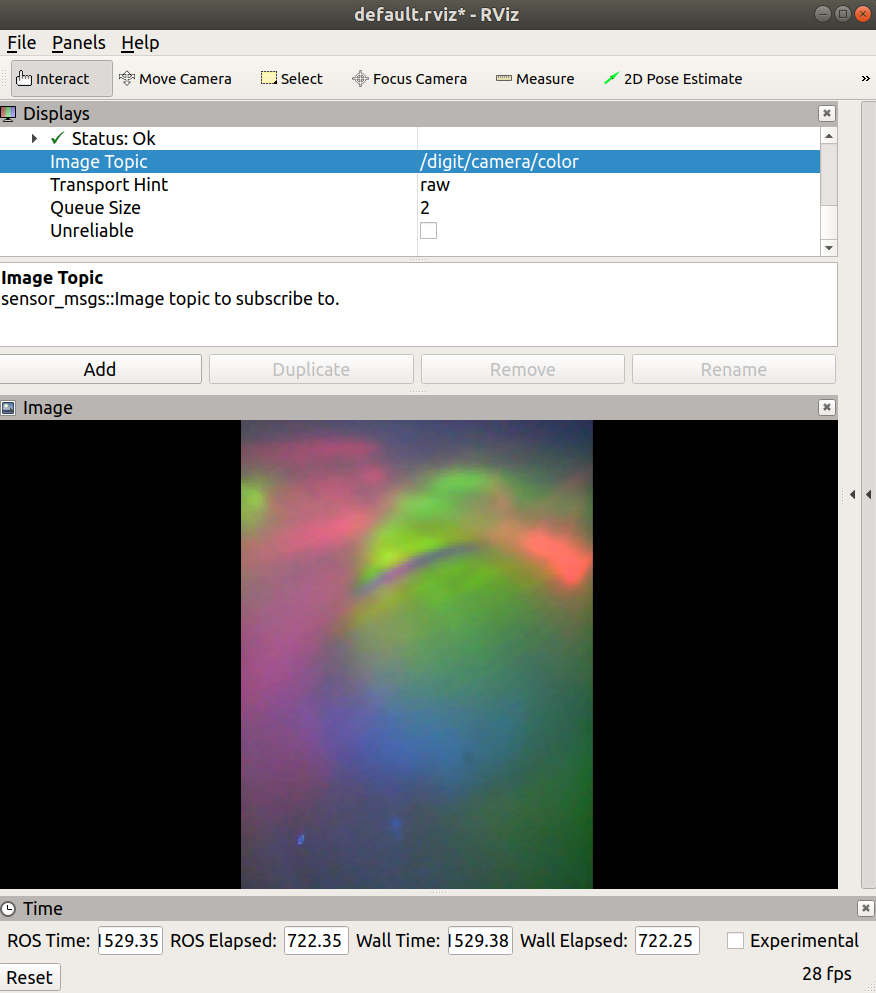

# DIGIT ROS DRIVER

Simple ROS Driver for DIGIT sensor




## Getting Started

The `Image` topic will be published under `/digit/camera/color`
```
# launch file
roslaunch digit_ros_driver digit_ros_driver.launch

# rosrun
rosrun digit_ros_driver digit_ros_driver.py
```
